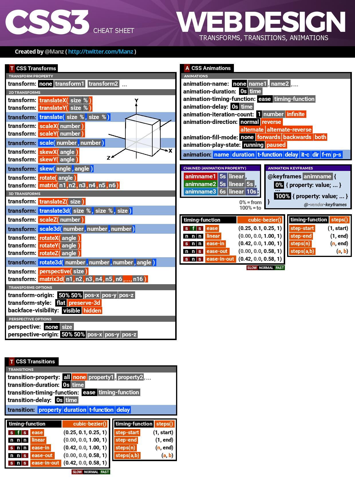
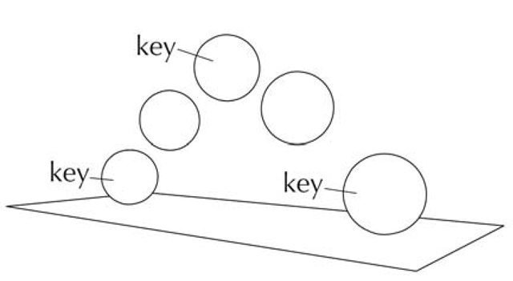

title: CSS Transforms Transitions Animations
class: animation-fade
layout: true

<!-- This slide will serve as the base layout for all your slides -->
.bottom-bar[
  {{title}} @ ITFactory Thomas More 2019
]

---

class: impact

# {{title}}
## Powered By CSS!

---

# Transforms, transitions en animations

.col-6[
* CSS3 eigenschappen voor verplatsen, animeren
* zorgen voor een mooier beeld
* Deze slides zijn **100%** HTML + CSS!
]

--

.col-6[
## Cheat sheet!

]

---

class: impact

# Transforms

---

# Transforms
## Het einde van enkel horizontaal werken

.col-6[
* Schalen
* Roteren
* Overhellen
* Verplaatsten
]

--

.col-6[
  ## Let op!
  andere elementen in de paginaopbouw worden niet "aan de kant geduwd".
]
---

.transform-1[
  # Transforms
]

## rotate

You can also add `code` to your slides:
```html
<div class="transform"><h1><Transforms</h1></div>
```
```css
.transform h1 {
    background-color: black;
    color: white;
    transform: rotate(3deg);
}
```
---

# Transforms
## Voorbeelden
.voorbeelden-transform[
  .transform-nr1[
    translate
  ]
  .transform-nr2[
    scale
  ]
  .transform-nr3[
    rotate
  ]
  .transform-nr4[
    skew
  ]
  .transform-nr5[
    origin
  ]
  .transform-nr6[
    meerdere
  ]
]

---

# Transforms
## notatie

```css
selector {
  transform: function(a[,b]);
}
```
## Functies
* translate, translateX, translateY
* scale, scaleX, scaleY
* skew, skewX, skewY
* rotate

---

# Meerdere Transforms
## notatie

```css
selector {
  transform: function(a[,b]) function(a[,b]) function(a[,b]);
}
```

---

# Translate

.col-8[
 verplaatsen over x-as en y-as
 ```css
 .box {
  transform:translate(0px, 0px);
 }
 ```
]

.col-4[
  .box[
    
  ]
]

---

# Translate

.col-8[
verplaatsen over x-as en y-as
 ```css
 .box {
  transform:translate(40px, 40px);
 }
 ```
]

.col-4[
  .box.translate20px[
    
  ]
]

---

# Scale

.col-8[
Schalen over breedte en hoogte
 ```css
 .box {
  transform:scale(1, 1);
 }
 ```
]

.col-4[
  .box[
    
  ]
]

---

# Scale

.col-8[
Schalen over 110% breedte en 60% hoogte
 ```css
 .box {
  transform:scale(1.1, 0.6);
 }
 ```
]

.col-4[
  .box.scale1106[
    
  ]
]

---

# Scale

.col-8[
Schalen over 110% breedte en 110% hoogte
 ```css
 .box {
  transform:scale(1.1);
 }
 ```
]

.col-4[
  .box.scale11[
    
  ]
]

---

# Rotate

.col-8[
Roteren: altijd in graden  
Positief = wijzerzin  
Negatief = **tegen**wijzerzin
 ```css
 .box {
  transform:rotate(0deg);
 }
 ```
]

.col-4[
  .box[
    Hello
  ]
]

---

# Rotate

.col-8[
Roteren: altijd in graden  
Positief = wijzerzin  
Negatief = **tegen**wijzerzin
 ```css
 .box {
  transform:rotate(45deg);
 }
 ```
]

.col-4[
  .box.rotate45[
    Hello
  ]
]

---

# Rotate

.col-8[
Roteren: altijd in graden  
Positief = wijzerzin  
Negatief = **tegen**wijzerzin
 ```css
 .box {
  transform:rotate(-45deg);
 }
 ```
]

.col-4[
  .box.rotatemin45[
    Hello
  ]
]

---

# Skew

.col-8[
Schuin trekken over x-as en y-as  
in graden
 ```css
 .box {
  transform:skew(0deg,0deg);
 }
 ```
]

.col-4[
  .box[
  ]
]

---

# Skew

.col-8[
Schuin trekken over x-as en y-as  
in graden
 ```css
 .box {
  transform:skew(45deg,20deg);
 }
 ```
]

.col-4[
  .box.skew4520[
  ]
]

---

# transform-origin
.col-8[
Transform werk vanuit het **middelpunt** van het object

## Punt aanpassen
```css
.box {
  transform:rotate(45deg);
  transform-origin: 0% 0%;
}
```
]

.col-4[
  .box.rotatemin45[
    Hello
  ]
]

---

# transform-origin
.col-8[
Transform werk vanuit het **middelpunt** van het object

## Punt aanpassen
```css
.box {
  transform:rotate(45deg);
  transform-origin: 0% 20%;
}
```
]

.col-4[
  .box.rotatemin45.to020[
    Hello
  ]
]

---

class: impact

# Transitions

---
# Transitions
## Notatie

```css
selector {
  transition: transition-property duration timing-function delay;
}
```

## Meerdere
```css
selector {
  transition: transition-property duration timing-function delay,
    transition-property duration timing-function delay;
}
```

---

# Transitions
.box.transin[

]

```css
.box {
    transition: background-color 500ms linear, 
      transform 1s ease-in 500ms;
}

.box:hover {
    background-color: blue;
    transform: rotate(-5deg) scale(1.5);
}
```

---

# Transitions
.box.trans2[

]

```css
.box {
    transition: all 1s linear;
}

.box:hover {
    border-radius: 50%;
    border: 8px solid #009cab;
    box-shadow: 3px 3px 6px #666;
}
```

---

# Transitions
.box.trans3[

]

```css
.box {
    transition: all 1s steps(3);
}

.box:hover {
    border-radius: 50%;
    border: 8px solid #009cab;
    box-shadow: 3px 3px 6px #666;
}
```

---

# Extra tutorials nodig?
https://youtu.be/JDNXYOHyOq4
<iframe width="560" height="315" src="https://www.youtube-nocookie.com/embed/JDNXYOHyOq4" frameborder="0" allow="accelerometer; autoplay; encrypted-media; gyroscope; picture-in-picture" allowfullscreen></iframe>

---

# Handige websites
## https://developer.mozilla.org/en-US/docs/Web/CSS/transform
## https://www.css3maker.com/css3-transform.html

---

class:impact

# Animations

---

# Animations
Vroeger **Flash**, later **JavaScript**, nu in **CSS3**

### 2 Types:
1. Vast moment, geen interactie nodig
1. Bij interactie (JS nodig)

---

# Animations
## Bestaan uit 2 delen

### Objecten
  ```css
.vorm {
  animation-name: verkleuren_en_verplaatsen; /*zie Keyframes*/
  animation-duration: 10s;
  animation-timing-function: ease-in-out;
  animation-iteration-count: infinite;
  animation-direction: alternate;
  animation-play-state: running;
  animation-delay: 2s;
}
```

---

# Animations
### Objecten
- **animation-name**: naam keyframes
- **animation-duration**: duur in seconden/milliseconden
- **animation-timing-function**: timing van frames *inear, ease, ease-in, steps, cubic-bezier*
- **animation-iteration-count**: herhaling *nummer of infinite*
- **animation-direction**: richting *normal, alternate,reverse, alternate-reverse*
- **animation-play-state**: status *running, paused* (kan uit spec verdwijnen);
- **animation-delay**: vertraging in seconden;
---

# Animations
### Keyframes



---

# Animations
### Keyframes
  ```css
@keyframes verkleuren_en_verplaatsen {
  0% {
    border-radius: 50%;
    background-color: red;
  }
  50% {
    background-color: green;
  }
  [...]
}
```

---

# Animations
### Keyframes
  ```css
@keyframes verkleuren_en_verplaatsen {
  [...]
  100% {
    border-radius: 0%;
    background-color: blue;
    transform: translateX(770px);
  }
}
```

---

# Animations
### Keyframes
  ```css
@keyframes border_radius_aanpassen {
  from {
    border-radius: 0%;
  }

  to {
    border-radius: 50%;
  }
}
```

---
class: impact
# Voorbeeldoefening
## Zie cursustekst

---

# CSS is Art
## Deel je kunsten
### https://codepen.io
## Speel met keyframes
### https://keyframes.app/editor/